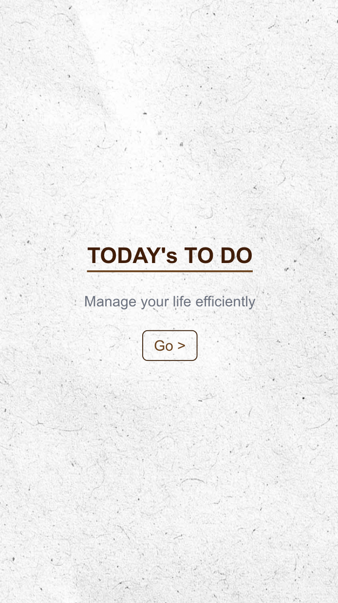
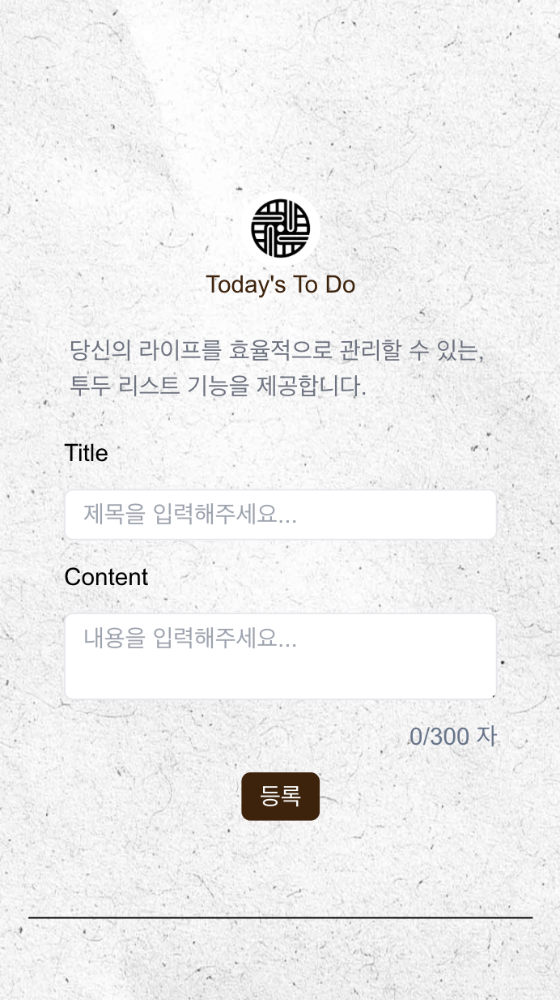
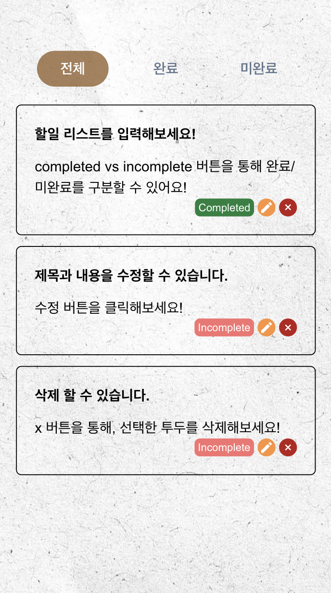
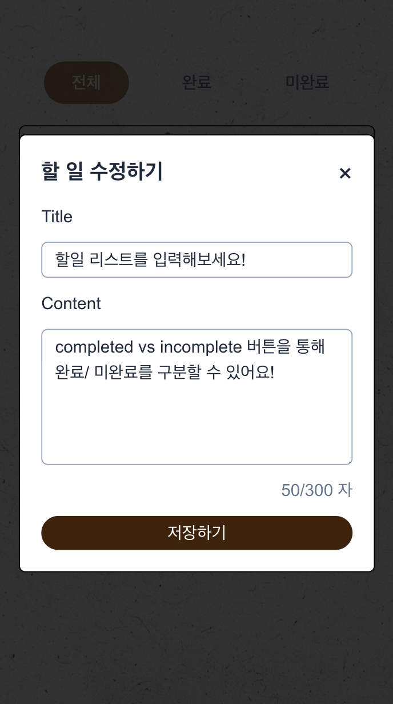

# 📄 Today's To Do - 투두 리스트

> _"Manage your life efficiently"_

🔗 서비스 바로가기 : https://my-todo-list-alpha-sage.vercel.app/

</br>

## 🎯 주요 기능`

🔹 투두 리스트 관리

- CRUD : 투두 추가, 수정, 삭제 가능
- 완료/미완료 토글 기능
- 필터기능 : 전체, 완료, 미완료 보기 지원
- 로딩 및 에러페이지

</br>

## 📂 프로젝트 구조

```
📦my-todo-list
 ┣ 📂public
 ┃ ┗ 📂images            # 이미지 폴더
 ┣ 📂src
 ┃ ┣ 📂app               # Next JS_App router 루트
 ┃ ┃ ┣ 📂todos           # 투두 페이지
 ┃ ┃ ┣ 📜error.tsx       # 전역 error 페이지
 ┃ ┃ ┣ 📜layout.tsx      # 루트 레이아웃
 ┃ ┃ ┣ 📜loading.tsx     # 로딩 페이지
 ┃ ┃ ┣ 📜page.tsx        # 랜딩 페이지
 ┃ ┃ ┗ 📜provider.tsx    # tanstack-query 프로바이더
 ┃ ┣ 📂components        # 컴포넌트
 ┃ ┣ 📂constants         # 상수
 ┃ ┣ 📂lib
 ┃ ┃ ┣ 📂hooks           # tanstack-query 훅
 ┃ ┃ ┗ 📂utils           # util 함수
 ┃ ┗ 📂types             # Todo 타입 정의
```

</br>

## 📸 프로젝트 미리보기

> 프로젝트 메인화면 & 투두 CRUD

<div>
  
  

  
  
</div>

</br>

## 🛠 기술 스택

|                                                            기술                                                             | 사용 목적                        |
| :-------------------------------------------------------------------------------------------------------------------------: | -------------------------------- |
|                       | 프론트엔드 프레임워크            |
|            | 정적 타입을 통한 안정성 확보     |
|  | 비동기 상태 및 캐싱 관리         |
|        | 전체 CSS 스타일링                |
|           | 로컬 API 서버 (Mock 데이터 생성) |
|                        | json-server 배포용 호스팅        |
|                        | Vercel 배포                      |
|                                               🛠 **Custom Hooks & Components**                                               | 코드 재사용성 향상               |
